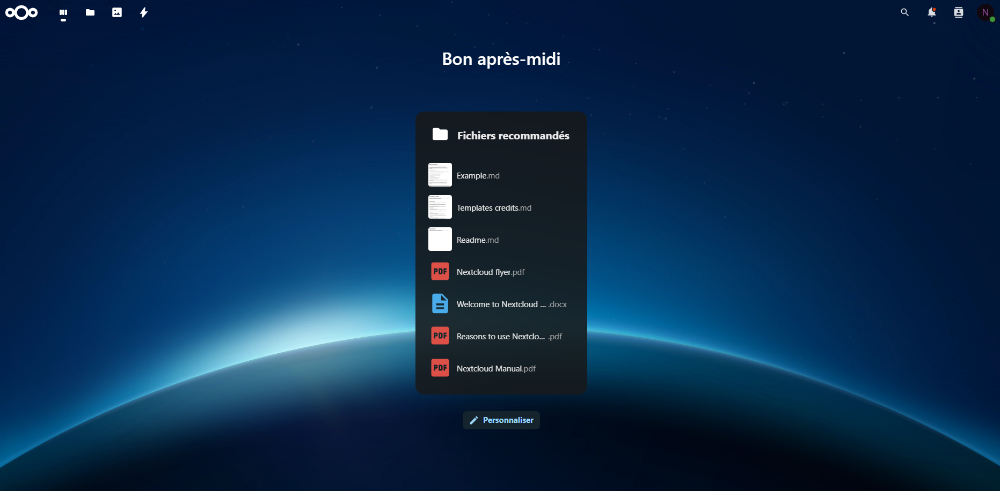

# Serveur Nextcloud

## Sommaire

- [Monter un serveur Nextcloud](#monter-un-serveur-nextcloud)
  - [Installation des paquets](#installation-des-paquets)
  - [Création de la base de données](#création-de-la-base-de-données)
  - [Configuration de Nextcloud](#configuration-de-nextcloud)
- [Interface utilisateur](#interface-utilisateur)

## Monter un serveur Nextcloud

### Installation des paquets

Dans un premier temps, il faut vérifier qu'aucune mise à jour n'est nécessaire sur le serveur :

```bash
apt-get update
apt-get upgrade
```

Ensuite, nous allons installer les modules nécessaires pour monter notre serveur :

```bash
apt-get install apache2 mariadb-server php8.1 php8.1-common php8.1-curl php8.1-gd php8.1-intl php8.1-mbstring php8.1-xmlrpc php8.1-mysql php8.1-xml php8.1-cli php8.1-zip wget unzip
```

Pour une question de praticité, je me déplace dans :

```bash
cd /var/www/html
```

Nous allons installer Nextcloud et le décompresser :

```bash
wget https://download.nextcloud.com/server/releases/latest.zip
unzip latest.zip
```

Le fichier latest.zip ne nous sert plus, donc je préfère directement le supprimer :

```bash
rm latest.zip
```

Il ne reste plus qu'à changer le propriétaire des fichiers de Nextcloud pour que ce soit l'utilisateur d'Apache2 :

```bash
chown -R www-data:www-data /var/www/html/nextcloud
```

### Création de la base de données

Pour cela, nous allons utiliser MariaDB :

```bash
mysql_secure_installation
```

Une fois cette étape terminée, connectez-vous à votre instance MariaDB avec le compte root et le mot de passe que vous venez de définir :

```bash
mysql -u root -p
```

Nous allons créer la base de données de Nextcloud :

```bash
CREATE DATABASE nextcloud;
```

Puis, nous créons un utilisateur et lui attribuons les droits sur la base de données :

```bash
GRANT ALL ON nextcloud.* TO 'usrnextcloud'@'localhost' IDENTIFIED BY 'MOT_DE_PASSE';
```

Évidemment, je ne vais pas montrer mon mot de passe.

```bash
FLUSH PRIVILEGES;
EXIT;
```

### Configuration de Nextcloud

Il suffit de rentrer l'adresse IP du serveur Nextcloud dans votre navigateur en tant qu'URL.


Sur cette page, entrez les informations créées au préalable, et c'est bon, le serveur Nextcloud est prêt.

## Interface utilisateur



Sur mon image, on voit la version PC, mais Nextcloud a aussi une version mobile, ce que je trouve bien pratique.
De plus, on peut aussi ajouter d'autres utilisateurs si on veut partager le cloud.