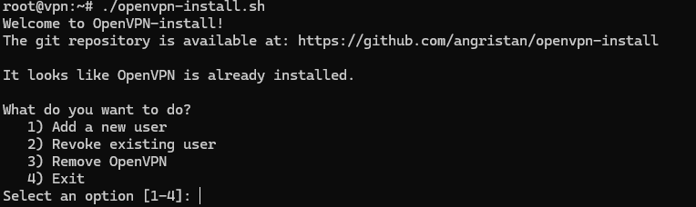
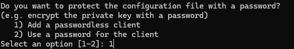

# Serveur OpenVPN

## Sommaire
- [Monter un serveur OpenVPN](#monter-un-serveur-openvpn)
- [Menu OpenVPN](#menu-openvpn)
- [Ajout de client](#ajout-de-client)

## Monter un serveur OpenVPN

Dans un premier temps, il faut vérifier qu'aucune mise à jour n'est nécessaire sur le serveur :

apt-get update
apt-get upgrade

Ensuite, nous allons installer les modules nécessaires pour monter notre serveur :

apt-get install curl

Téléchargez le script d'installation avec curl :

curl -O https://raw.githubusercontent.com/Angristan/openvpn-install/master/openvpn-install.sh

Dès que le script est téléchargé, vous devez ajouter les droits d'exécution afin de pouvoir l'exécuter par la suite :

chmod +x openvpn-install.sh

Exécutez le script pour commencer la configuration pas à pas du serveur OpenVPN :

./openvpn-install.sh

## Menu OpenVPN

Une fois la commande exécutée, une configuration s'affiche. Je ne la montre pas sur GitHub, mais elle est bien guidée, ce qui évite de faire des erreurs.

## Ajout de client

Une fois l'option sélectionnée, il faut entrer le nom de l'utilisateur.

Ensuite, il faut choisir si le client doit se connecter avec un mot de passe ou non. Dans notre cas, nous choisissons de ne pas utiliser de mot de passe.

Et c'est bon, il ne reste plus qu'à envoyer la configuration OVPN au client pour qu'il ait accès au VPN. Dans notre cas, le fichier est nommé "demo1.ovpn".
